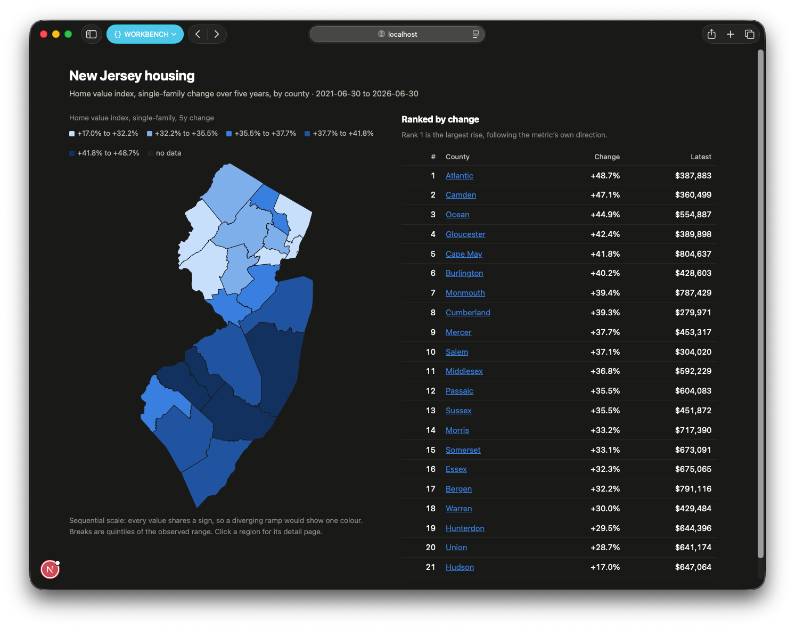
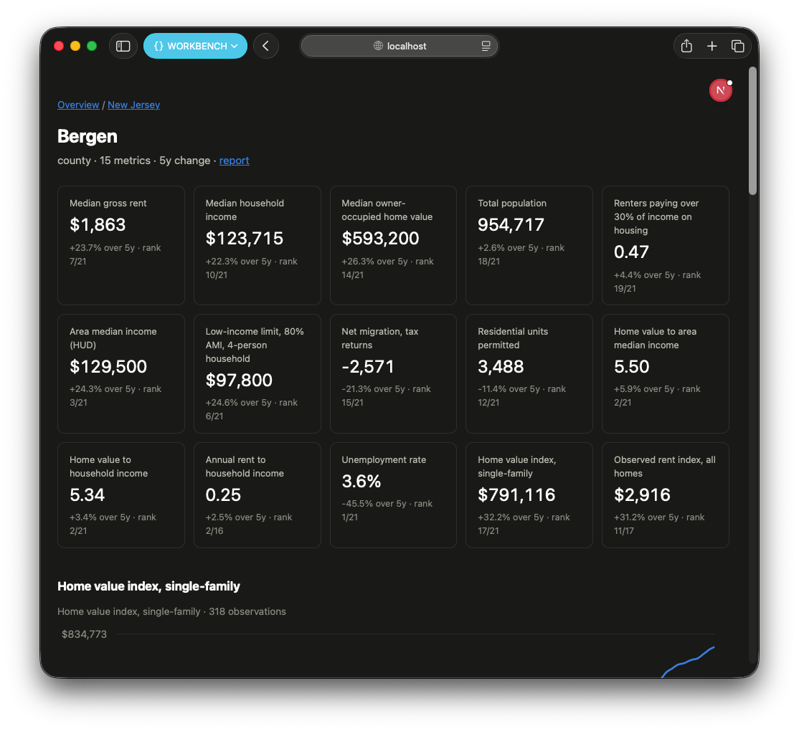
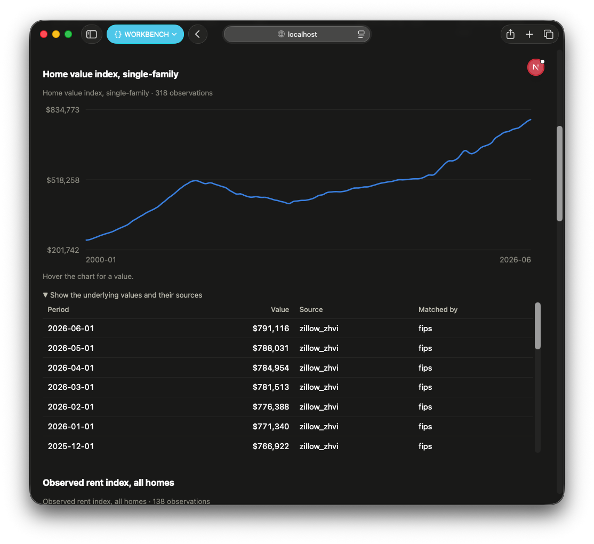
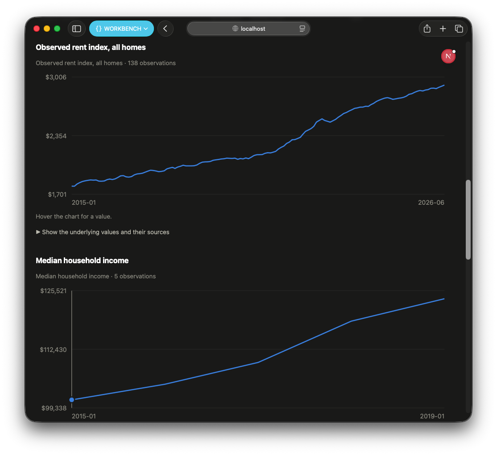
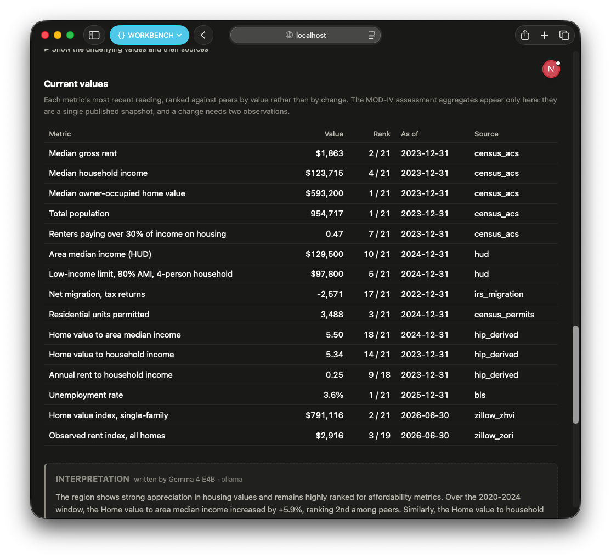
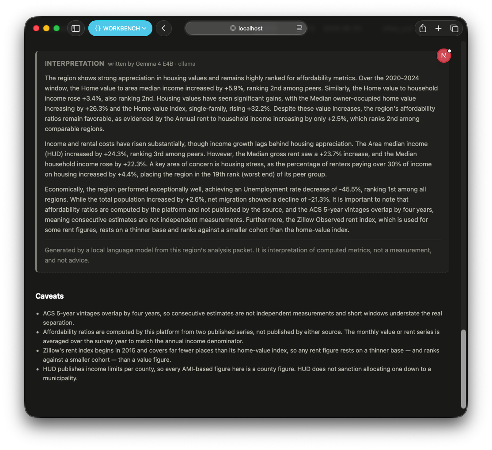
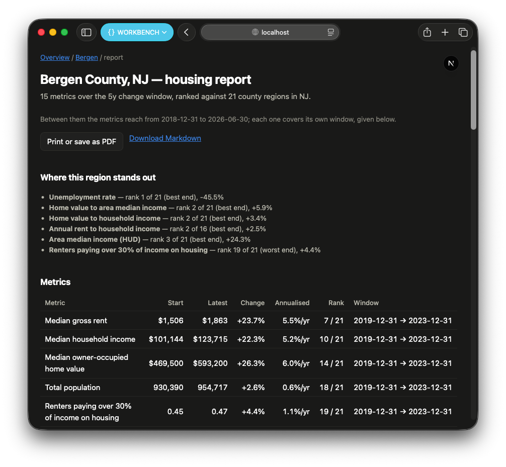
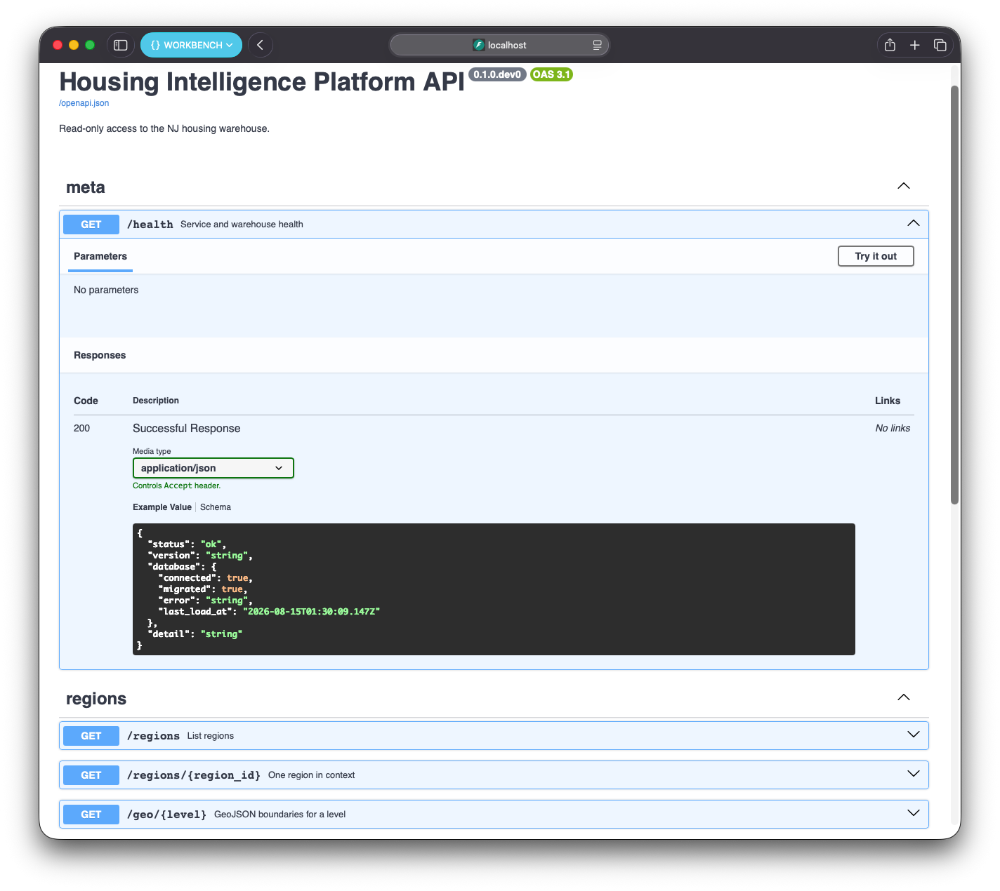

# Housing Intelligence Platform

A local-first analytics platform that turns fragmented public housing data into a
queryable warehouse of housing intelligence, starting with New Jersey. It pulls parcel
and MOD-IV records, Zillow ZHVI and ZORI, Census ACS and Building Permits, FHFA HPI,
FRED, BLS, and IRS migration data through one staged pipeline, resolves everything to a
shared geography spine, and computes the facts — value growth, rent growth, affordability
change, construction activity, county rankings — before anything is displayed. It is
built for someone who wants to ask where affordability is worsening fastest in New Jersey
and get a defensible answer with the source file behind every number. It is not a
chatbot and not a listings site: dashboards, maps, rankings, reports, and an API are the
product, and an optional AI layer only explains metrics that were already computed.

> **Status (2026-09-05): v0.11.0, Version 1 complete and Version 2 under way.** New
> Jersey's geography, its housing and economic context, and its **property tax roll**
> are loaded, queryable, visible, and exportable — 3,365 regions, **3.48M parcels**, and
> **335,927 observations across 23 metrics from 10 public sources, spanning 1971 to
> 2026**, plus 19,527 computed changes and 27,819 rankings, served behind a three-page
> dashboard and packaged as versioned analysis packets. All eight pipeline stages run.
> The source file and match method are recorded on every value. Eight local models were
> then evaluated against standardized scenarios built from those packets, and the winner
> writes a short interpretation on each county page — clearly labeled as interpretation,
> never as measurement.
>
>
> **Version 2 is live.** The platform now publishes itself: `hip publish` records the
> API's answers as 5,844 static files and the dashboard pre-renders 2,273 pages, served
> with no database and no application server in production. Milestone 10 measured what a
> state costs on disk (3.4 GB for New Jersey, 40 kB per region of PostGIS geometry);
> Milestone 11 put the result on the internet.
>
> See [ROADMAP.md](ROADMAP.md) for what is planned and [CHANGELOG.md](CHANGELOG.md)
> for what shipped.

Read [SPEC.md](SPEC.md) for what the platform is meant to do and why, and
[ARCHITECTURE.md](ARCHITECTURE.md) for how it is built.

## Screenshots

All eight are the running application against a fully loaded warehouse — no mockups, no
seeded demo data.


*The overview — a county choropleth of five-year home-value change beside the ranking table it is drawn from, both served by the same query.*


*A county detail page: 15 metric tiles, each carrying its five-year change and its rank among the 21 NJ counties.*


*Every trend chart opens into the values behind it, with the source release and the geography match method on each row.*


*Series are drawn over whatever history the source actually publishes — 138 monthly rent observations here, 5 annual income ones.*


*Current values ranked by value rather than by change, which is the only way snapshot sources like MOD-IV become visible at all.*


*The selected model's interpretation, styled to be unmistakable as commentary and followed by the caveats the platform computes for itself. Captured 2026-08-14, when that model was Gemma 4 E4B running locally; the panel's shape is the durable part, not the runtime behind it.*


*The print-ready region report, rendered from the same packet the API serves — this is Bergen County, published in full at [`reports/regions/5y/34003.md`](reports/regions/5y/34003.md).*


*The read-only API documents itself — OpenAPI 3.1 at `/docs`, every endpoint runnable from the page.*

## Features

Each is listed with the milestone that delivers it, so this section can be checked
against [ROADMAP.md](ROADMAP.md) rather than believed.

- **Config-driven source registry** (M0, built) — 13 public sources and 23 metrics
  defined in YAML with license, cadence, and update frequency. `hip check-config`
  validates them and catches a metric naming an undefined source, or a source whose
  API key is missing, before any fetch is attempted.
- **Enforced module boundaries** (M0, built) — a test parses every module's imports and
  fails the build if the API reaches into the pipeline, or if an import flows backward
  along it. The read-only API is structural, not a convention.
- **NJ geography spine** (M1, built) — one `regions` table covering state, county,
  municipality, ZIP, and tract with PostGIS geometry and parent roll-up, plus
  area-weighted crosswalks for ZIPs, which nest in nothing. County and municipality
  counts match New Jersey's real ones (21 and 564), not just whatever the source
  returned.
- **Reproducible acquisition** (M1, built) — raw downloads are immutable and
  content-addressed, cached by hash so a re-run touches no network, and every load
  records the exact file it came from. Re-running the pipeline is a no-op, verified:
  `region_id` values are stable across reloads because facts will reference them.
- **Staged public-data pipeline** (M2–M6, built) — eight CLI stages from download to
  analysis packet, each persisting before the next runs: `acquire`, `land`, `stage`,
  `geocode`, `validate`, `load`, `analyze`, `pack`. `make pipeline` runs them in order
  and a failing validation gate stops the chain.
- **Provenance on every value** (M2, built) — each observation carries the source
  release and how its geography was resolved (`fips`, `zip_code`, `name_county`), so a
  county figure matched on FIPS is distinguishable from a municipal one matched by name.
- **Home values and rents** (M2, built) — Zillow ZHVI and ZORI at county, municipal,
  and ZIP level. County coverage is 21/21 and ZIP 548/598; municipalities reach 403/564
  because Zillow publishes no FIPS below county level, and ambiguous name matches are
  rejected rather than guessed. `/sources/unresolved` names every gap and why.
- **A validation gate that blocks bad loads** (M2, built) — duplicate observations,
  out-of-range values, orphaned regions, and coverage collapse each stop the load before
  it reaches the warehouse. It has already caught a real bug: 318 duplicate rows caused
  by name normalization merging two distinct municipalities.
- **Economic and demographic context** (M3, built) — ACS income, rent, population, home
  value, and renter cost burden; building permits; FHFA HPI; the 30-year mortgage rate;
  county unemployment; and net migration. ACS is FIPS-exact at municipal level, which
  takes municipal coverage to 564/564.
- **Computed housing intelligence** (M4, built) — percentage change and CAGR over
  1y/3y/5y/10y/since-2019, price-to-income and rent-to-income affordability, and rank
  plus percentile per metric and level, all calculated in SQL rather than inferred by a
  model. `/regions/{id}/summary` returns the headline changes with the caveats that
  qualify them.
- **Allocation by households, not acres** (M9, built) — ZIP-level data is allocated
  using HUD residential-address ratios rather than land area, so a half-empty ZIP no
  longer contributes as if it were fully built out. Affordability can also be expressed
  against HUD's published area median income, not only an ACS survey estimate.
- **Dashboard and maps** (M5, built) — county choropleth and ranking table on the
  overview, region detail pages with metric tiles and trend charts, and a table view of
  every series with its source. Drawn as inline SVG from our own GeoJSON: no map
  library, no tile server, no third-party in the render path.
- **Read-only analytics API** (M4–M6, built) — FastAPI endpoints for regions, metrics,
  rankings, comparisons, GeoJSON boundaries, analysis packets, and Markdown reports.
- **Analysis packets** (M6, built) — small versioned JSON documents holding computed
  metrics with their ranks, the peer cohort, caveats, and the source releases behind
  every value: the entire contract any future model is allowed to see. The schema is
  published at [`schemas/packet-v1.json`](schemas/packet-v1.json), generated from the
  code and checked against it by a test. `hip pack` writes one per region.
- **Exportable region reports** (M6, built) — the same packet rendered as Markdown by
  `hip pack --report` or `GET /regions/{id}/report`, and as a print-ready page at
  `/regions/[id]/report` in the dashboard. Two media, one contract, no PDF library. All
  21 counties are published under [`reports/regions/5y/`](reports/regions/5y/) —
  [Bergen](reports/regions/5y/34003.md) is the one shown above.
- **NJ parcels and the property tax roll** (M7, built) — 3.48M parcels acquired from
  NJGIN's ArcGIS service and held in Parquet/DuckDB, aggregated to six municipality
  metrics that describe the housing *stock*: median assessed value, parcel count, median
  year built, median lot size, vacant land share, and apartment share. Matched to Census
  municipalities on the legal form ("Boonton township" against "Boonton town"), which
  reaches 554 of 564 with zero ambiguity where Zillow's name matching ceilings at 403.
- **Ranked by value, not only by change** (M7, built) — "which municipality is most
  expensive" is now a query, not just "which rose fastest". Snapshot sources like MOD-IV
  have no change at all, so without this their data would load and stay invisible.
- **A model chosen by measurement** (M8, built) — **Gemma 4 E4B** (Q4_K_M via Ollama)
  was selected from eight candidates across two runtimes on observed performance on this
  task: 3.21/4.00 weighted rubric score, 0.0% of stated figures unsupported, 3/3 correct
  refusals, 28.6 tok/s. The published report at
  [`reports/evaluation/v1.md`](reports/evaluation/v1.md) shows the evidence, including the
  matched anchor pair that makes the cross-runtime comparison legitimate and the three
  candidates that proved unusable on this hardware; the
  [excerpt below](#model-evaluation--run-v1) has the headline tables.
- **Model evaluation harness** (M8, built) — five standardized scenarios built from
  real analysis packets, run against eight local candidates across two runtimes through
  one `ModelRunner` protocol, with sampling pinned identically on both sides. Every
  stated figure is verified against the packet deterministically, so hallucination rate
  is counted rather than graded; Claude scores only what a reader can judge. A model
  that fabricates figures above a 5% rate is ineligible however well it writes.
- **Explanations labeled as interpretation** (M8, built) — `hip explain` generates a
  short narrative per region with the selected model and stores it with the model name,
  the runtime, and a hash of the packet it was written from.
  `GET /regions/{id}/explanation` serves it with `kind: "interpretation"` and a `stale`
  flag; the dashboard panel is styled to be unmistakable as commentary. The platform is
  fully usable with none of this generated — a missing explanation renders nothing.

## Sample output

`reports/` is machine-local output, but two sets are published so the claims above can be
read without building the warehouse first: the
[21 county reports](reports/regions/5y/) and the
[model-evaluation report](reports/evaluation/v1.md). Both stay rebuildable — the commands
below overwrite them — and the excerpts here link to the full text.

**The excerpts below are dated, and the linked files are the live version.** Figures were
published on 2026-08-14 and are copied here by hand, so a source release that revises
history will move the numbers in the linked report without moving the ones quoted here.
The two kinds of excerpt age differently: the region report is pipeline output and
changes whenever a source publishes, while the evaluation is a record of one experiment
against packets as they stood on that date, and does not change when data refreshes.

### Region report — Bergen County, 5y window, as published 2026-08-14

Written by `uv run hip pack --report` to
[`reports/regions/5y/34003.md`](reports/regions/5y/34003.md), and served unchanged by
`GET /regions/8/report?window=5y`. The other 20 counties are in the
[same directory](reports/regions/5y/).

`region_id` is a surrogate key, not a GEOID: Bergen is region 8 and GEOID 34003, and the
two are not derivable from one another. An earlier version of this line said region 11,
which is Mercer. Look an id up with `/regions?level=county&q=Bergen` rather than
guessing it — the `curl` examples further down do exactly that.

> **Where this region stands out**
>
> - **Unemployment rate** — rank 1 of 21 (best end), -45.5%
> - **Home value to area median income** — rank 2 of 21 (best end), +5.9%
> - **Home value to household income** — rank 2 of 21 (best end), +3.4%
> - **Annual rent to household income** — rank 2 of 16 (best end), +2.5%
> - **Area median income (HUD)** — rank 3 of 21 (best end), +24.3%
> - **Renters paying over 30% of income on housing** — rank 19 of 21 (worst end), +4.4%

Six of the report's 15 metrics. Each carries its own window, because each source
publishes on its own cadence and none are stretched to match:

| Metric | Start | Latest | Change | Annualised | Rank | Window |
| --- | ---: | ---: | ---: | ---: | ---: | --- |
| Median gross rent | $1,506 | $1,863 | +23.7% | 5.5%/yr | 7 / 21 | 2019-12-31 → 2023-12-31 |
| Median household income | $101,144 | $123,715 | +22.3% | 5.2%/yr | 10 / 21 | 2019-12-31 → 2023-12-31 |
| Area median income (HUD) | $104,200 | $129,500 | +24.3% | 5.6%/yr | 3 / 21 | 2020-12-31 → 2024-12-31 |
| Home value to household income | 5.16 | 5.34 | +3.4% | 0.8%/yr | 2 / 21 | 2019-12-31 → 2023-12-31 |
| Unemployment rate | 6.6% | 3.6% | -45.5% | -11.4%/yr | 1 / 21 | 2020-12-31 → 2025-12-31 |
| Home value index, single-family | $598,242 | $791,116 | +32.2% | 5.7%/yr | 17 / 21 | 2021-06-30 → 2026-06-30 |

Rank 1 is the better end of the cohort as the metric defines better, not always the
largest rise. The [full report](reports/regions/5y/34003.md) adds the remaining nine
metrics, a current-values table ranked by value, and the caveats that qualify each figure.

### Model evaluation — run `v1`, 2026-08-14

Written by `uv run hip eval report` to
[`reports/evaluation/v1.md`](reports/evaluation/v1.md). 120 generations from 8 models over
5 scenarios and 3 regions.

**Selected: Gemma 4 E4B** (`gemma-4-e4b-q4`, gguf cohort, Q4_K_M) — rubric score
3.21/4.00, 0.0% of stated figures unsupported, 28.6 tok/s. Chosen on measured performance
on this task, not on benchmark reputation, and only from among models that cleared the
deterministic bar first: any model fabricating more than 5% of its figures is ineligible
however well it reads.

Deterministic checks — counted, not graded. Every figure a model stated is matched
against the packet it was given; no language model is involved:

| Model | Cohort | Answers | Figures | Unsupported | Empty | Errors | Refusal |
|---|---|---:|---:|---:|---:|---:|---:|
| Gemma 4 E4B | gguf | 15 | 77 | 0.0% | 0 | 0 | 3/3 |
| Nemotron 3 Nano 4B | gguf | 15 | 64 | 0.0% | 2 | 0 | 3/3 |
| Gemma 4 E4B | mlx | 15 | 0 | 0.0% | 0 | 15 | — |
| Gemma 4 12B (QAT) | gguf | 15 | 48 | 0.0% | 6 | 0 | 3/3 |
| Qwen3.5 9B | mlx | 15 | 2660 | 0.1% | 0 | 0 | 0/3 |
| Qwen3 8B | mlx | 15 | 72 | 2.8% | 1 | 0 | 3/3 |
| Qwen3 8B | gguf | 15 | 89 | 4.5% | 0 | 0 | 3/3 |
| Phi-4 mini reasoning | mlx | 15 | 462 | 6.1% | 5 | 0 | 0/3 |

Rubric scores, graded by `claude-opus-5` against the criteria in
`config/evaluation.yml`. Final answers only — reasoning tokens are measured as cost,
never graded as quality:

| Model | Weighted | Factual accuracy | Grounding | Caveat handling | Clarity | Flagged |
|---|---:|---:|---:|---:|---:|---:|
| Gemma 4 E4B | 3.21 | 3.8 | 3.5 | 2.5 | 3.5 | 0 |
| Qwen3 8B (gguf) | 3.05 | 3.5 | 3.3 | 2.2 | 3.5 | 5 |
| Qwen3 8B (mlx) | 2.91 | 3.3 | 3.3 | 2.0 | 3.2 | 4 |
| Nemotron 3 Nano 4B | 2.51 | 3.4 | 2.9 | 1.4 | 2.3 | 1 |
| Gemma 4 12B (QAT) | 2.10 | 2.4 | 2.4 | 1.5 | 2.3 | 0 |
| Qwen3.5 9B | 1.58 | 1.9 | 2.3 | 1.7 | 0.5 | 9 |
| Phi-4 mini reasoning | 1.34 | 1.5 | 1.7 | 1.1 | 0.8 | 16 |

The [full report](reports/evaluation/v1.md) adds the matched anchor pair that makes the
cross-runtime comparison legitimate, the completeness and instruction-following columns,
throughput and peak memory, and the artifacts in `data/eval/v1/` that every figure
recomputes from.

## Tech Stack

| Layer | Choice | Why |
|-------|--------|-----|
| Language | Python 3.12.13, TypeScript | Python for data work, TypeScript for the dashboard |
| CLI | Typer | One command per pipeline stage; the only write path |
| Raw storage | Parquet | Immutable columnar landings, readable without a database |
| Transform | DuckDB + dbt-core | Out-of-core SQL over Parquet, with lineage and tests |
| Warehouse | PostgreSQL 16 + PostGIS | Concurrent readers, constraints, spatial queries |
| API | FastAPI + SQLAlchemy | Read-only, typed, OpenAPI for free |
| Dashboard | Next.js 16 + React 19 | Charts, maps, and comparison views over the API |
| Packaging | `uv`, Docker Compose | Locked Python env; Postgres is the only container |

The reasoning behind each of these, and what was rejected, is in the Decisions Log in
[ARCHITECTURE.md](ARCHITECTURE.md).

## Setup

**Prerequisites**

- [`uv`](https://docs.astral.sh/uv/) — installs the pinned Python 3.12.13 itself
- Node.js 20+ for the dashboard
- Docker Desktop, for Postgres + PostGIS (`brew install --cask docker-desktop`)
- Free API keys in `.env`: `CENSUS_API_KEY` and `FRED_API_KEY` are required (neither has
  a usable anonymous tier), `BLS_API_KEY` is strongly recommended — without it BLS
  returns 3 years of history instead of 20. Links are in `.env.example`.

```bash
git clone https://github.com/jasonli-git/housing-intelligence.git
cd housing-intelligence
make setup
```

`make setup` syncs the Python environment, installs dashboard dependencies, creates the
local `data/` directories, and copies `.env.example` to `.env` if you have none.

For the Milestone 8 evaluation, run `make setup-eval` instead: it adds the optional
`mlx` and `eval` groups. Note that `uv sync` makes the environment match exactly the
groups it is given, so a later plain `make setup` **uninstalls** them again.

**Build the warehouse.** The first `acquire` downloads ~2GB — 635MB of Census
TIGER/Line (529MB of it the national ZCTA file), 245MB of Zillow CSVs, and 1.16GB of NJ
parcels assembled from 1,741 API requests over roughly 32 minutes. Everything is cached
by content hash and never re-downloaded.

```bash
make db-up         # Postgres 16 + PostGIS, waits for the healthcheck
make migrate       # alembic upgrade head
make pipeline      # acquire → … → analyze → pack, all eight stages
```

**Run it.**

```bash
make api           # http://localhost:8000  (OpenAPI docs at /docs)
make web           # http://localhost:3000
make test          # 223 Python + 26 dashboard tests; API tests skip without a warehouse
make lint          # ruff + ruff format --check + mypy --strict
```

Try it:

```bash
curl 'http://localhost:8000/metrics'
curl 'http://localhost:8000/regions?level=county&q=Mercer'
curl 'http://localhost:8000/regions/11/metrics?metric_id=zhvi_sfr&from=2025-01-01'
curl 'http://localhost:8000/sources/unresolved'
curl 'http://localhost:8000/rankings?metric_id=price_to_income&level=county&window=5y'
curl 'http://localhost:8000/regions/11/summary?window=5y'
curl 'http://localhost:8000/regions/11/packet?window=5y'
curl 'http://localhost:8000/regions/11/report?window=5y'
curl 'http://localhost:8000/rankings?metric_id=modiv_median_assessed_value&level=municipality&basis=value'
```

Packets and reports on disk, and the contract they satisfy:

```bash
uv run hip pack --report          # data/packets/5y/ and reports/regions/5y/
uv run hip pack --region 11       # one region
uv run hip schema                 # the published JSON Schema
uv run hip footprint              # bytes per storage tier and rows per state
uv run hip footprint --json       # the same, for capturing into a document
```

Evaluate local models and generate explanations (Milestone 8, needs `make setup-eval`,
Ollama running, and Apple silicon for the MLX cohort):

```bash
uv run hip eval models             # candidates, and whether each runtime can serve them
uv run hip eval scenarios          # build the question set from real packets
uv run hip eval run                # every scenario through every model — hours
uv run hip eval cost               # what judging would cost, without spending it
uv run hip eval judge              # rubric grading; the only command that costs money
uv run hip eval report             # reports/evaluation/<run>.md
uv run hip explain --region 11     # write an explanation the API can serve
```

`make` on its own lists every target. With the warehouse down, the API and dashboard
still run and report the degraded state rather than failing.

**If `uv run hip` ever fails with `ModuleNotFoundError: No module named 'hip'`**, run
`make venv-fix`. `uv` marks its `.pth` files hidden on macOS and CPython skips hidden
`.pth` files; `make` targets are immune because they export `PYTHONPATH`.

**API keys.** `CENSUS_API_KEY` and `FRED_API_KEY` are required from Milestone 3;
`BLS_API_KEY` is optional but raises a 25-query daily limit. All three are free.
`ANTHROPIC_API_KEY` is the one paid key and is read by `hip eval judge` alone — every
other stage runs without it. `.env.example` links to each signup page.

## Publishing

The platform has no request-time compute, so production is a set of files rather than a
running service. `make publish` builds them; `make deploy` sends them.

```bash
make publish   # dist/artifacts (5,845 files, 84 MB) + dist/site (11,375 files, 254 MB)
make deploy    # artifacts -> object storage, site -> static host
```

Two directories because they go to two hosts, and that split is forced by measurement
rather than taste (ARCHITECTURE #68): the export is three times the size of the data it
displays, and static hosts cap files per deployment where object stores do not.

`make deploy` runs `make check-dist` first, which refuses to ship a tree that is
incomplete or that has `localhost` baked into its links — a static export has no runtime
in which to correct a wrong artifact origin, so it would otherwise publish 1,135 dead
download links silently.

**One-time setup.** Deployment targets Cloudflare, but nothing about the artifacts is
Cloudflare-specific — they are ordinary files at ordinary paths, and any object store
and static host will serve them.

1. Create an R2 bucket, and connect a custom domain to it for public reads.
2. Create an R2 API token with **Object Read & Write**, scoped to that bucket alone.
3. Configure an `rclone` remote named `r2` (type `s3`, provider `Cloudflare`) with those
   keys and the bucket's S3 endpoint. `no_check_bucket = true` is required: a token
   scoped to one bucket cannot list buckets, and rclone's default existence check fails
   with a 403 that reads like bad credentials.
4. Set `ARTIFACT_URL`, `R2_BUCKET`, and `PAGES_PROJECT` in the Makefile. They live
   there rather than in `.env` because none is secret — the artifact URL is embedded in
   1,135 public pages — and `.env` is gitignored, so a fresh clone would silently build
   with `localhost`.

Deploys are direct uploads, not a Git integration, and cannot be otherwise: the build
fetches 1,135 regions from a local API backed by a warehouse that is gitignored by design
(#10). A hosted builder has nothing to build from.

## Project Status

v0.10.0 — **Version 1 is complete; Version 2 is under way.**

Version 1 built the platform: geography, prices, rents, economic context, computed change
and affordability and rankings, the dashboard, versioned analysis packets with exportable
reports, the NJ parcel and MOD-IV layer, and the evaluated local-model explanation layer.
The AI layer is optional throughout — with no explanations generated, every page and
endpoint still works.

Version 2 moves it off `localhost` and past New Jersey: static publication on a public
domain, hosted inference in place of local generation, citation binding, expansion to the
Northeast and then to every US county, a three-dimensional national map, a consumer entry
point, and a design system. Nine milestones, two shipped.

**Milestone 10 — build cost and data placement (2026-09-02).** `hip footprint` reports
bytes per storage tier, per warehouse table, and per state, including the Postgres size
that lives inside Docker where `du` cannot reach it. Storage locations became settings
rather than paths derived from one another, so the data root, the reports directory, and
the Postgres data directory each relocate independently. Nothing user-facing changed;
what changed is that the cost of adding a state is now measured instead of estimated.

**Milestone 11 — static publication (2026-09-05).** `hip publish` renders the enumerable
API surface to files whose paths mirror the endpoints, produced by replaying the API's own
ASGI app so the bytes on disk are the bytes the API serves. The dashboard is a static
export over the same 1,135 regions. `make publish` builds both halves; `make deploy` sends
artifacts to object storage and the site to a static host. Production runs no database and
no application server.

Milestones and their status are in [ROADMAP.md](ROADMAP.md); the current working list and
known rough edges are in [TODO.md](TODO.md). Work not scheduled for Version 2 is listed at
the end of the roadmap.

<!-- sitrep:requirements:start -->
<!-- generated by sitrep — do not edit by hand -->

### Resource Requirements

Measured, not estimated — 3 runs of `make pipeline`.

| | Measured |
|---|---|
| **Recommended RAM** | 2.0 GB |
| Peak RAM | 889 MB _(885 MB – 899 MB)_ |
| **CPU load** | **Moderate** — 8.2% of a 10-core machine |
| CPU time | 18 s _(18 s – 18 s)_ |
| Peak CPU | 901% _(868% – 915%)_ of one core <sub>(per 50 ms window)</sub> |
| Wall clock | 22 s _(22 s – 22 s)_ |
| Disk read | 59 MB _(57 MB – 690 MB)_ |
| Disk write | 72 MB _(70 MB – 72 MB)_ |
| Peak swap-out rate | 0 — no swapping |

Measured on Mac16,10 · Apple M4 · 16 GB · 10 cores · macOS 26.6.2 (25G83).

> Not measured on this machine: `thermal.temperature`, `thermal.fan`, `network.per_process`, `process.other_users`, `power.package` — see `sitrep doctor`.

<sub>Generated by [mac-sitrep](https://github.com/jasonli-git/mac-sitrep) 1.1.1 from `v0.9.0` on 2026-08-28.</sub>

<!-- sitrep:requirements:end -->

The figures above are a **warm** run: `hip acquire` returns cached releases without
touching the network unless `--force`, so nothing is downloaded during a profiled
`make pipeline`. Cold-run cost is not measured.

### Storage Footprint

What the platform still occupies after a run, which is the number that multiplies when
geography expands. `mac-sitrep` measures I/O volume during a run; this measures what is
left behind. Postgres is included because it lives inside Docker's disk image, where
neither sitrep nor `du data/` can see it.

Measured 2026-09-02 with `uv run hip footprint`, New Jersey loaded:

| Tier | Size |
|---|---|
| raw | 2.1 GB |
| parquet | 898.5 MB |
| duckdb | 80.8 MB |
| packets | 6.9 MB |
| **filesystem** | **3.1 GB** |
| postgres | 339.3 MB |
| **total** | **3.4 GB** |

Inside Postgres, the two tables that scale with geography:

| Table | Size | Rows |
|---|---|---|
| `fact_metric_observation` | 170.9 MB | 335,927 |
| `regions` | 135.3 MB | 3,366 |

`regions` is 40 kB per row because it carries PostGIS geometry, so it grows with region
count rather than with observation count — the reason a state's cost is dominated by how
finely it is subdivided rather than by how much history it has.

New Jersey holds 3,365 regions and 335,263 observations; the `US` nation-level row
accounts for the remaining 664.
